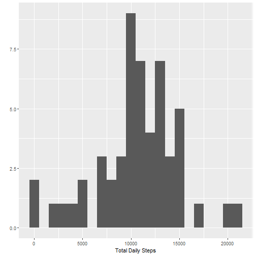
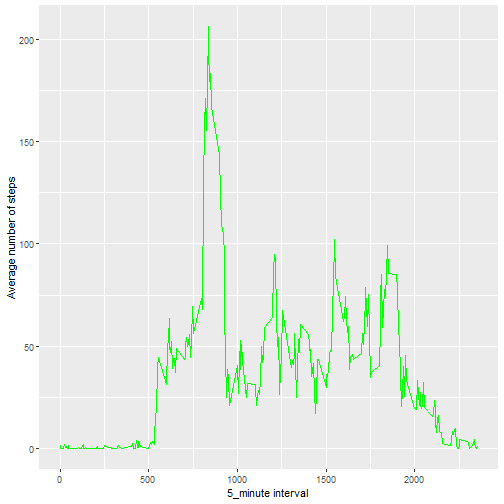
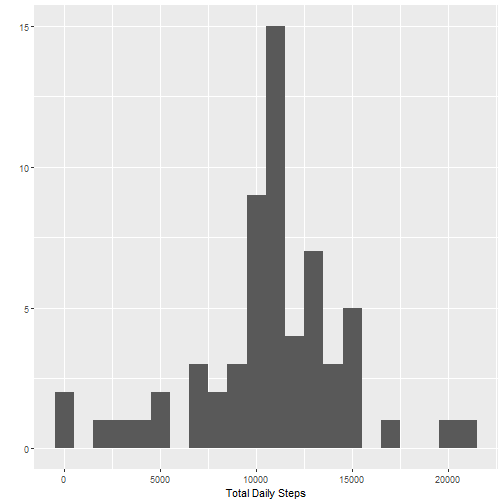
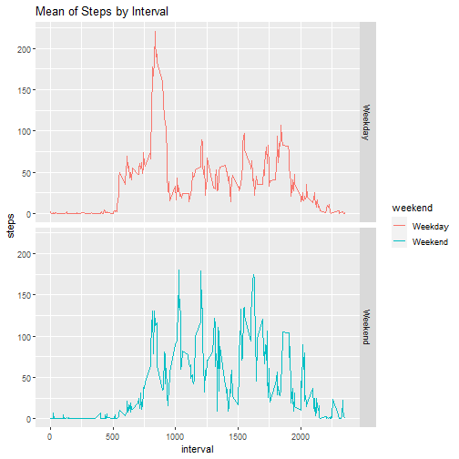

## Assignment: Data Analysis

This assignment makes use of data from a personal activity monitoring device. This device collects data at 5 minute intervals through out the day. The data consists of two months of data from an anonymous individual collected during the months of October and November, 2012 and include the number of steps taken in 5 minute intervals each day.

The data for this assignment can be downloaded from the course web site:

- *Dataset*: [Activity monitoring data](https://d396qusza40orc.cloudfront.net/repdata%2Fdata%2Factivity.zip)

The variables in this dataset are:

- **steps**: Number of steps taking in a 5-minute interval (missing values are coded as **NA**)
- **date**: The date on which the measurement was taken in YYYY-MM-DD format.
- **interval**: Identifier for the 5-minute interval in which measurement was taken.


In the following, several questions are answered to obtain an exploratory basis for the given data set:


## Loading and preprocessing the data


```r
# Download file:

download.file("https://d396qusza40orc.cloudfront.net/repdata%2Fdata%2Factivity.zip", 
              destfile = "activity.zip", 
              mode="wb")

# Unzip data and read: 

unzip("activity.zip")
Data <- read.csv("activity.csv", header = TRUE)
```

The data was saved in the **Data** variable, now they are displayed.


```r
head(Data,5)
```

```
##   steps       date interval
## 1    NA 2012-10-01        0
## 2    NA 2012-10-01        5
## 3    NA 2012-10-01       10
## 4    NA 2012-10-01       15
## 5    NA 2012-10-01       20
```

```r
str(Data)
```

```
## 'data.frame':	17568 obs. of  3 variables:
##  $ steps   : int  NA NA NA NA NA NA NA NA NA NA ...
##  $ date    : chr  "2012-10-01" "2012-10-01" "2012-10-01" "2012-10-01" ...
##  $ interval: int  0 5 10 15 20 25 30 35 40 45 ...
```

Load the libraries that will be used in this report:


```r
library(ggplot2)
```

```
## Warning: package 'ggplot2' was built under R version 4.0.2
```

```r
library(stats)
library(dplyr)
```

```
## Warning: package 'dplyr' was built under R version 4.0.2
```

```
## 
## Attaching package: 'dplyr'
```

```
## The following objects are masked from 'package:stats':
## 
##     filter, lag
```

```
## The following objects are masked from 'package:base':
## 
##     intersect, setdiff, setequal, union
```

- Now the data is organized and cleaned (Delete the N/A)


```r
Data$date <- as.Date(as.character(Data$date))   
DataNA <- is.na(Data$steps)
cleanData <- Data[!DataNA,]
```

The missing NA values were deleted. Now the variable **cleanData** has the original data, but without the NA values.


```r
str(cleanData)
```

```
## 'data.frame':	15264 obs. of  3 variables:
##  $ steps   : int  0 0 0 0 0 0 0 0 0 0 ...
##  $ date    : Date, format: "2012-10-02" "2012-10-02" ...
##  $ interval: int  0 5 10 15 20 25 30 35 40 45 ...
```

## What is mean total number of steps taken per day?

- Calculate the total number of steps taken per day


```r
total_steps <- tapply(cleanData$steps, cleanData$date, FUN=sum)
```

- Calculate and report the mean and median of the total number of steps taken per day:


```r
mean(total_steps)
```

```
## [1] 10766.19
```

```r
median(total_steps)
```

```
## [1] 10765
```

- Make a histogram of the total number of steps taken each day:


```r
plot_1 <- qplot(total_steps, 
                binwidth=1000, 
                geom="histogram", 
                xlab="Total Daily Steps")
print(plot_1)
```




## What is the average daily activity pattern?


```r
pattern_average <- aggregate(x = list(steps = cleanData$steps), 
                             by = list(interval = cleanData$interval),
                             FUN = mean)
```

- Make a time series plot of the 5-minute interval (x-axis) and the average number of steps taken, averaged across all days (y-axis)


```r
plot_2 <- ggplot(data = pattern_average, aes(x=interval, y=steps)) +
          geom_line(color = 'green') +
          xlab("5_minute interval") +
          ylab("Average number of steps")
print(plot_2)
```



- Which 5-minute interval, on average across all the days in the dataset, contains the maximum number of steps?


```r
pattern_average[which.max(pattern_average$steps),]
```

```
##     interval    steps
## 104      835 206.1698
```

## Imputing missing values

The **Data** dataset has missing values **NA**, which we remove and create a new **cleanData** dataset; now a *strategy* is proposed to NOT remove this missing data but to *replace* these missing values to use the original data set in its entirety.

- Calculate and report the total number of missing values in the **Data**.


```r
missing_values <- sum(is.na(Data))
missing_values
```

```
## [1] 2304
```

- Devise a strategy for filling in all of the missing values in the **Data**.

*Strategy*:


```r
replace_mean <- function(x) replace(x, is.na(x), mean(x, na.rm = TRUE))
```

- Create a new dataset that is equal to the original dataset but with the missing data filled in.

*New data*:


```r
newData <- Data %>% 
           group_by(interval) %>% 
           mutate(steps = replace_mean(steps))
```

View **newData**:


```r
head(newData,10)
```

```
## # A tibble: 10 x 3
## # Groups:   interval [10]
##     steps date       interval
##     <dbl> <date>        <int>
##  1 1.72   2012-10-01        0
##  2 0.340  2012-10-01        5
##  3 0.132  2012-10-01       10
##  4 0.151  2012-10-01       15
##  5 0.0755 2012-10-01       20
##  6 2.09   2012-10-01       25
##  7 0.528  2012-10-01       30
##  8 0.868  2012-10-01       35
##  9 0      2012-10-01       40
## 10 1.47   2012-10-01       45
```

```r
dim(newData)
```

```
## [1] 17568     3
```

It is checked that **newData** is the dataset resulting from **Data**, applying the strategy of filling in all the missing values.


```r
missing_values_newData <- sum(is.na(newData$steps))
missing_values_newData
```

```
## [1] 0
```

- Make a histogram of the total number of steps taken each day in **newData**:


```r
total_steps_newData <- tapply(newData$steps, newData$date, FUN=sum)

plot_3 <- qplot(total_steps_newData, 
                binwidth=1000, 
                geom="histogram", 
                xlab="Total Daily Steps")
print(plot_3)
```



- Calculate and report the mean and median of the total number of steps taken per day in **newData**:


```r
mean(total_steps_newData)
```

```
## [1] 10766.19
```

```r
median(total_steps_newData)
```

```
## [1] 10766.19
```

- Do these values differ from the estimates from the first part of the assignment?


```r
dif_mean <- mean(total_steps_newData) - mean(total_steps)
dif_mean
```

```
## [1] 0
```

```r
dif_median <- median(total_steps_newData) - median(total_steps)
dif_median
```

```
## [1] 1.188679
```

## Are there differences in activity patterns between weekdays and weekends?

For this part the **weekdays()** function may be of some help here. Use the dataset with the filled-in missing values for this part, e.i, **newData**.


- Create a new factor variable in the dataset with two levels – *“weekday”* and *“weekend”* indicating whether a given date is a weekday or weekend day.


```r
newData$date <- as.Date(newData$date)
newData$weekday <- weekdays(newData$date)
newData$weekend <- ifelse(newData$weekday == "sabado" | newData$weekday == "domingo", "Weekend", "Weekday" )

newData_weekend_weekday <- aggregate(newData$steps, by = list(newData$weekend, newData$interval), mean)
```

Assign the following names to **newData_weekend_weekday**


```r
names(newData_weekend_weekday) <- c("weekend", "interval", "steps")
```

- Make a panel plot containing a time series plot of the *5-minute interval (x-axis)* and the average number of steps taken, averaged across all *weekday days or weekend days (y-axis)*.


```r
plot_4 <- ggplot(newData_weekend_weekday, aes(x = interval, y = steps, color = weekend)) + geom_line() + facet_grid(weekend ~ .) + labs(title = "Mean of Steps by Interval", x = "interval", y = "steps")

print(plot_4)
```


